# Mermaid диаграммы для игровой системы

Коллекция Mermaid диаграмм для визуализации архитектуры и процессов.

**Как использовать**: Скопируйте код диаграммы и вставьте в:
- [Mermaid Live Editor](https://mermaid.live/)
- GitHub/GitLab (поддерживают Mermaid нативно)
- VS Code с расширением Mermaid

---

## 1. Архитектура системы (Layered Architecture)

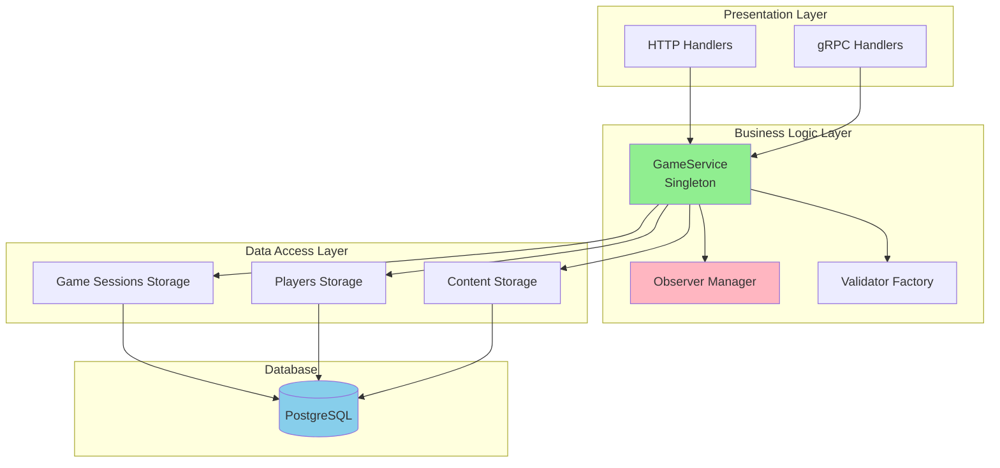

---

## 2. Компонентная архитектура (userver Components)

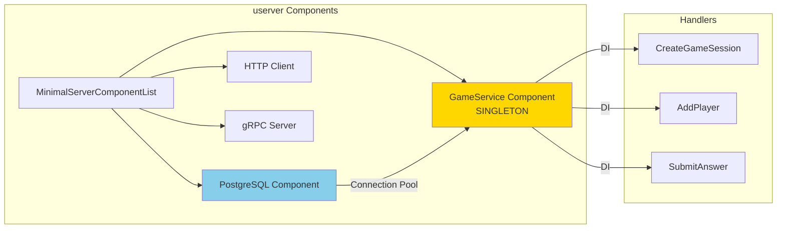

---

## 3. Состояния игровой сессии (State Machine)

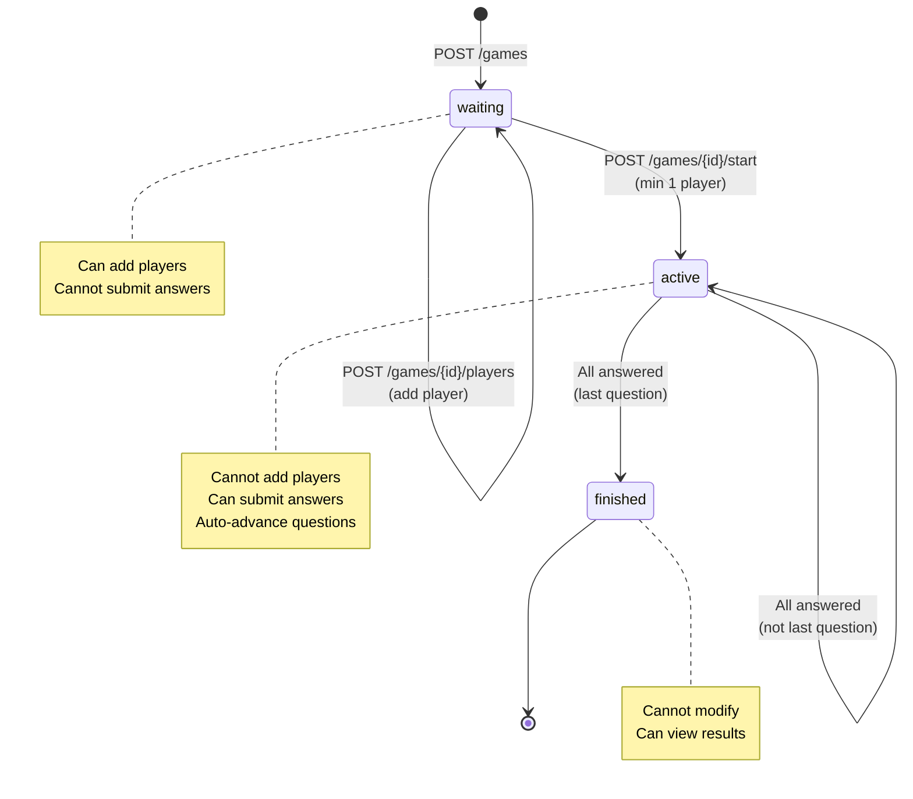

---

## 4. Игровой процесс (Game Flow Sequence)

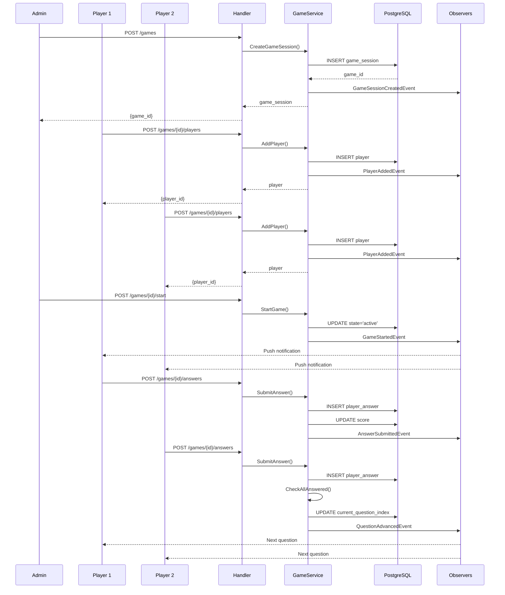

---

## 5. Observer Pattern

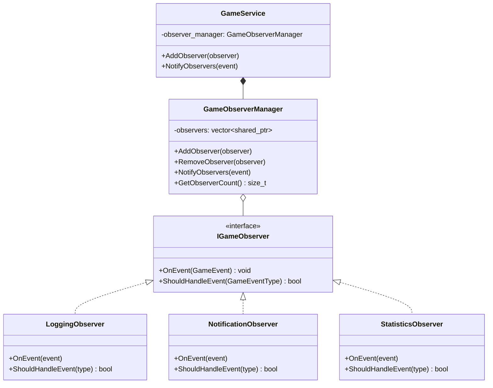

---

## 6. Поток данных при отправке ответа (Data Flow)

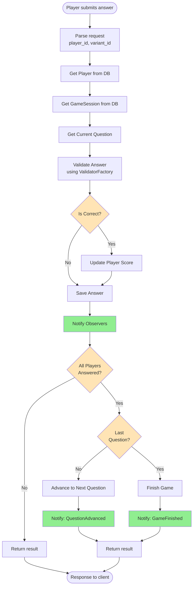

---

## 7. Database Schema (ER Diagram)

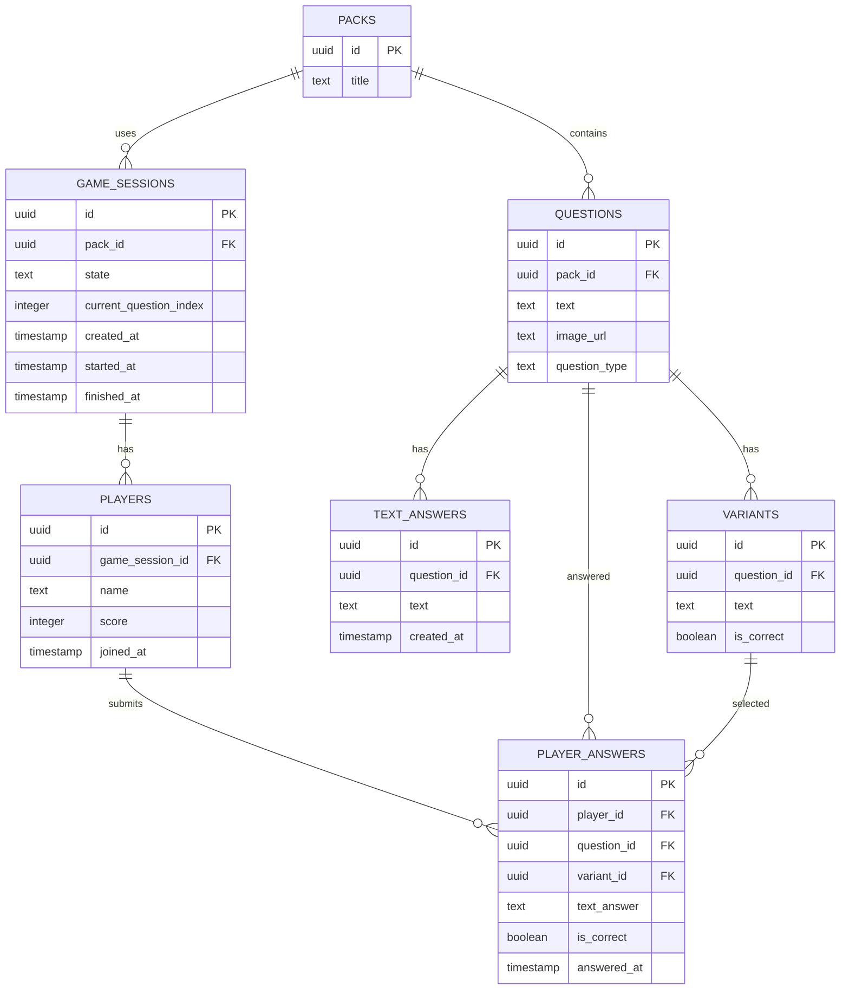

---

## 8. Deployment Architecture

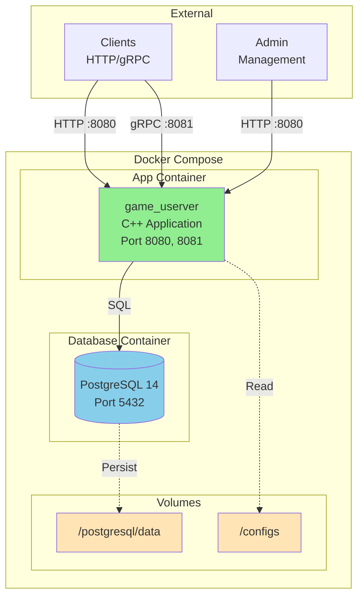

---

## 9. Request Processing Pipeline

```mermaid
flowchart LR
    subgraph "Client"
        C[HTTP Client]
    end
    
    subgraph "userver Framework"
        L[Listener<br/>:8080]
        TP[Task Processor<br/>Worker Threads]
        R[Router]
    end
    
    subgraph "Application"
        H[Handler]
        GS[GameService]
        S[Storage]
    end
    
    subgraph "Database"
        CP[Connection Pool]
        DB[(PostgreSQL)]
    end
    
    C -->|HTTP Request| L
    L --> TP
    TP --> R
    R -->|Route| H
    H -->|Business Logic| GS
    GS -->|Data Access| S
    S -->|Get Connection| CP
    CP -->|SQL Query| DB
    DB -->|Result| CP
    CP -->|Return| S
    S -->|Data| GS
    GS -->|Response| H
    H -->|JSON| R
    R --> TP
    TP --> L
    L -->|HTTP Response| C
    
    style TP fill:#FFE4B5
    style GS fill:#90EE90
    style CP fill:#87CEEB
```

---

## 10. Validator Factory Pattern

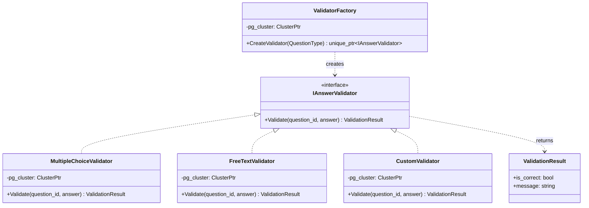

---

## 11. Concurrent Game Sessions

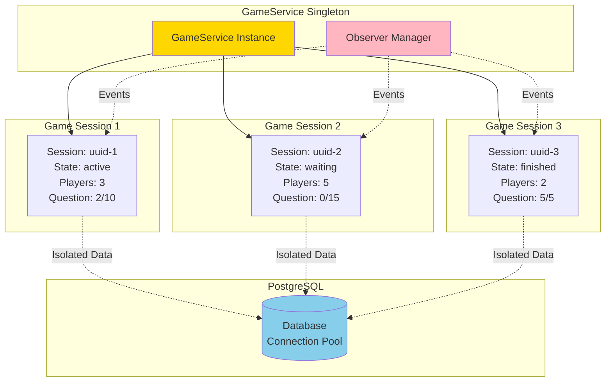

---

## 12. Error Handling Flow

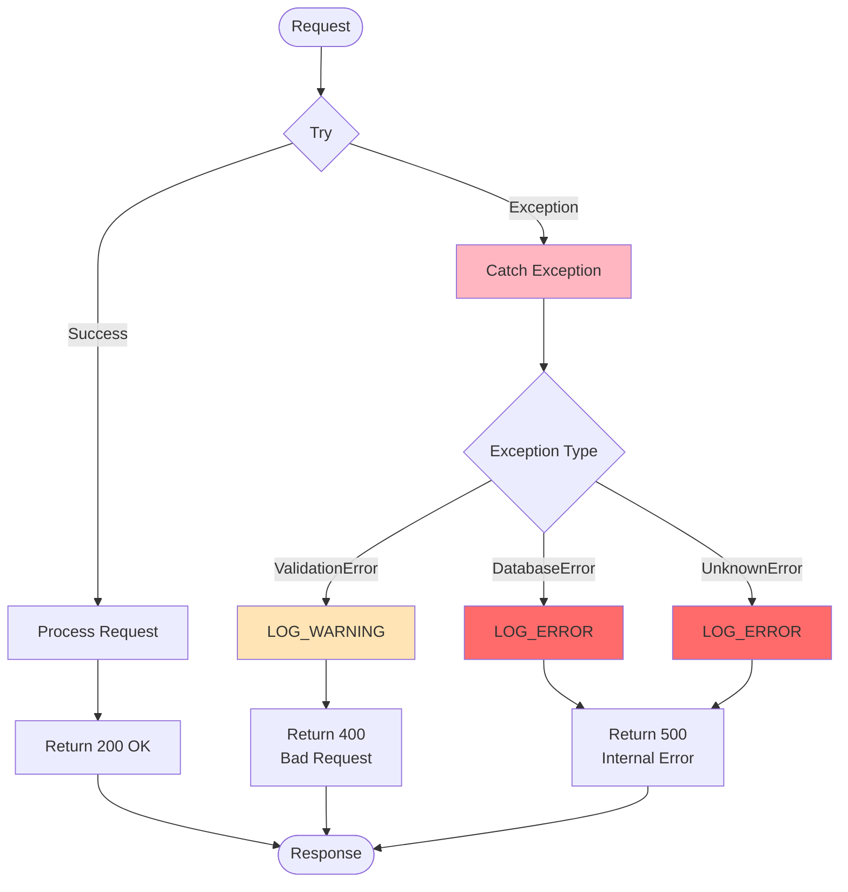

---

## Как использовать эти диаграммы

### 1. В GitHub/GitLab
Просто вставьте код в markdown файл:
````markdown
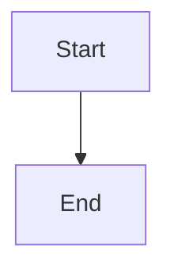
````

### 2. В Mermaid Live Editor
1. Откройте https://mermaid.live/
2. Вставьте код диаграммы
3. Экспортируйте как PNG/SVG

### 3. В VS Code
1. Установите расширение "Markdown Preview Mermaid Support"
2. Откройте preview (Ctrl+Shift+V)
3. Диаграммы отобразятся автоматически

### 4. Генерация изображений через CLI
```bash
# Установка mermaid-cli
npm install -g @mermaid-js/mermaid-cli

# Генерация PNG
mmdc -i diagram.mmd -o diagram.png

# Генерация SVG
mmdc -i diagram.mmd -o diagram.svg
```

---

## Дополнительные диаграммы

Если нужны дополнительные диаграммы для:
- Конкретных use cases
- Детальных sequence diagrams
- Специфичных компонентов

Просто запросите, и я добавлю их в этот файл!